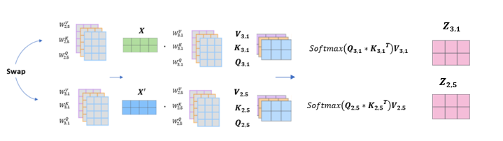
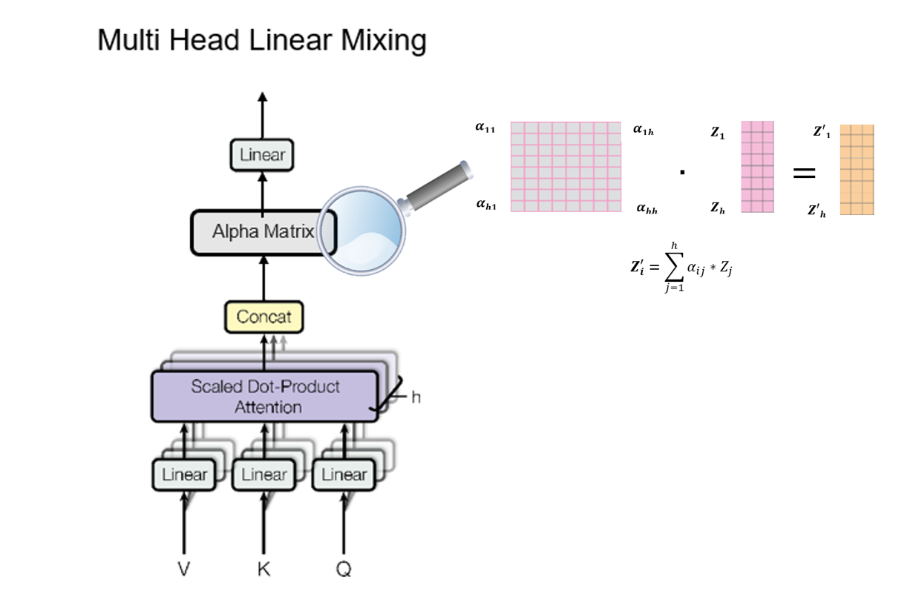
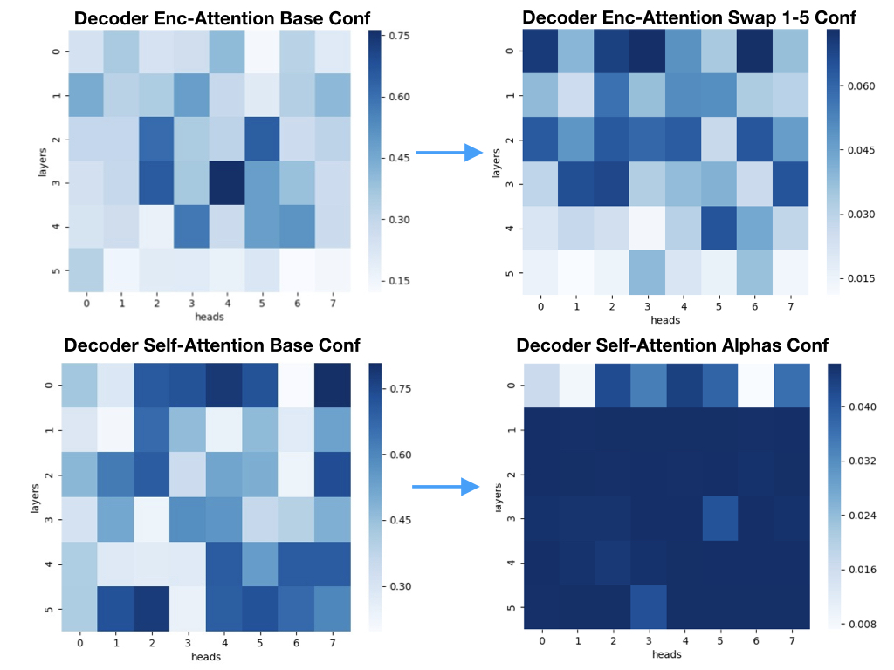

# Multi-Head Rotation - a Multi-Head Attention Utilisation Using Parameters Rotation and Linear Mixing

## Introduction
In this work we :

* Propose some manual and dynamic methods for parameter swappings during the training of the Tranformer model.
* Suggest a new component added to the Multi-head Attention mechanism, we called the Alpha Matrix. It is in charge of heads mixing in the MHA mechanism.
* Examine the effect of such parameter swapping and heads mixing on two transltion task's datasets.

We provide here our code and the steps needed in order to reproduce our experiments. 


## Prerequisite

- [PyTorch](http://pytorch.org/) version >= 1.4.0
- Python version >= 3.6
- For training new models, you'll also need an NVIDIA GPU and [NCCL](https://github.com/NVIDIA/nccl)
- Then, clone our repo :
```bash
git clone https://github.com/omerlandau/MHR-NLP-Transformers
```

## Experiments

### Parameter Swapping


**Manual**
1. Edit the fairseq_cli/config_mhr_swap.json file.
   * Control the epochs which the swappings will be done.
   * Control the transformer module(encoder\decoder) and the attention type (self attention\encoder attention) of the swapped elements.
   
2. In oreder to train a transformer model(with 8 heads in both encoder and decoder) on the IWSLT14 DE-EN dataset ,with our hyperparameters, run: 
```bash
CUDA_VISIBLE_DEVICES=0 PYTHONIOENCODING=utf-8 fairseq-train \
    data-bin/iwslt14.tokenized.de-en
    --max-epoch 50
    --save-dir "checkpoints-folder"
    --arch transformer_iwslt_de_en --share-decoder-input-output-embed
    --optimizer adam --adam-betas '(0.9, 0.98)' --clip-norm 0.0 
    --lr 5e-4 --lr-scheduler inverse_sqrt --warmup-updates 4000 --warmup-init-lr '1e-07'
    --min-lr '1e-09' --dropout 0.3 --weight-decay 0.0001
    --criterion label_smoothed_cross_entropy --label-smoothing 0.1
    --max-tokens 4096     --eval-bleu
    --eval-bleu-args '{"beam": 5, "max_len_a": 1.2, "max_len_b": 10}'
    --eval-bleu-detok moses     --eval-bleu-remove-bpe
    --eval-bleu-print-samples     --decoder-attention-heads 8 --encoder-attention-heads 8
    --best-checkpoint-metric bleu --maximize-best-checkpoint-metric
   --mhr-experiment  "fairseq_cli/config_mhr_swap.json"
  ```

**Dynamic**

### Linear Mixing

As mentioned in tha paper, several hyper-parameters had been explored in this section : gamma, the statring point of using the Nuc-norm,controling the Multi Head Attention elements in which the Nuc-norm applies e.g. only applies it to decoder-encoder attention and the growth radius (indicated as delta_r in the paper).
In order to run an experiment of mixing with growth raidus of 0.0001, gamma 40, start using the Nuc-norm loss only after training 31% of the epochs, on all MHA components and with ours other hyper-parameters: 
```bash 
CUDA_VISIBLE_DEVICES=0 PYTHONIOENCODING=utf-8 fairseq-train \
    data-bin/iwslt14.tokenized.de-en
    --max-epoch 50
    --save-dir "checkpoints-folder"
    --arch transformer_iwslt_de_en --share-decoder-input-output-embed
    --optimizer adam --adam-betas '(0.9, 0.98)' --clip-norm 0.0 
    --lr 5e-4 --lr-scheduler inverse_sqrt --warmup-updates 4000 --warmup-init-lr '1e-07'
    --min-lr '1e-09' --dropout 0.3 --weight-decay 0.0001
    --criterion label_smoothed_cross_entropy --label-smoothing 0.1
    --max-tokens 4096     --eval-bleu
    --eval-bleu-args '{"beam": 5, "max_len_a": 1.2, "max_len_b": 10}'
    --eval-bleu-detok moses     --eval-bleu-remove-bpe
    --eval-bleu-print-samples     --decoder-attention-heads 8 --encoder-attention-heads 8
    --best-checkpoint-metric bleu --maximize-best-checkpoint-metric
   --mhr-experiment  "fairseq_cli/config_mhr_swap.json" --gamma-conf 40
   --radius 0.0001 --loss-start-after 0.31 --dec-enc-alpha-loss-ratio 1 
   --dec-self-alpha-loss-ratio 1 --enc-self-alpha-loss-ratio 1
   ```
   
   
## Analysis

### Heads Importance Distribution


